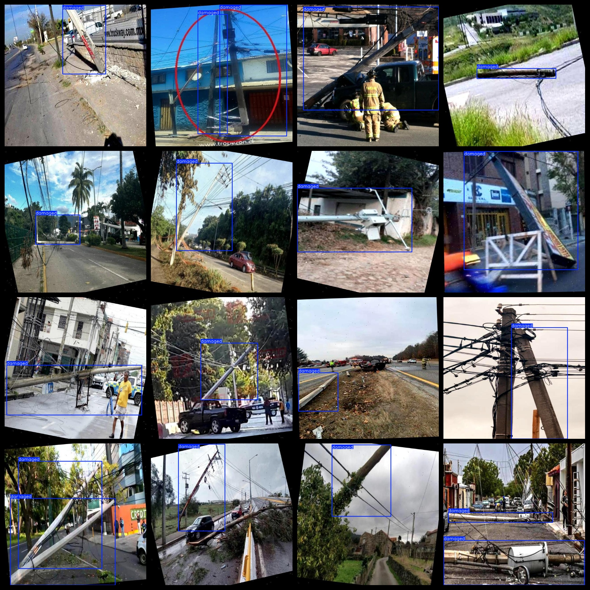
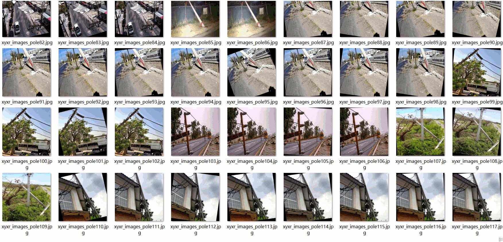

# Utility Pole Defect Detection Dataset 7503 images1-classLabels VOC+YOLO format

The dataset for defect detection of electric wire poles, which consists of 7503 images with a single-category label (VOC+YOLO format).

Dataset format: Pascal VOC format + YOLO format (the txt file does not contain the split path, it only contains jpg images and corresponding VOC format xml files and yolo format txt files)

Number of images (total number of jpg files): 7503

Number of xml files: 7503

Number of txt files: 7503

Number of categories: 1

The Github repository is: datasets_sl

Label category name: ["damaged"]

Number of boxes labeled in each category:

Damaged frame count = 9198

Total frame count: 9198

Number of images per category:

"damaged" is an adjective that means "broken or damaged." It does not have a direct numerical value. The sentence you provided seems to be incomplete, as it doesn't specify what the relationship between "damaged" and "7503" is. Could you please provide more context or clarify the meaning?

Image resolution: 640x640

Use the labeling tool: labelImg

Dataset Augmentation: Yes

Rules for annotation: Draw a rectangle around the category.

Important note: The dataset does not have been divided into training, validation, and testing sets.

Special Disclaimer: This dataset does not guarantee the accuracy of the trained models or weight files.

Annotation and image details are as follows:

## Images

---

Here is a pay link on Stripe (https://buy.stripe.com/3cs8yP7sY87d0vu9AB). Please contact me lonlonago@foxmail.com after funding $89, and I will send you a complete data files, thank you!

